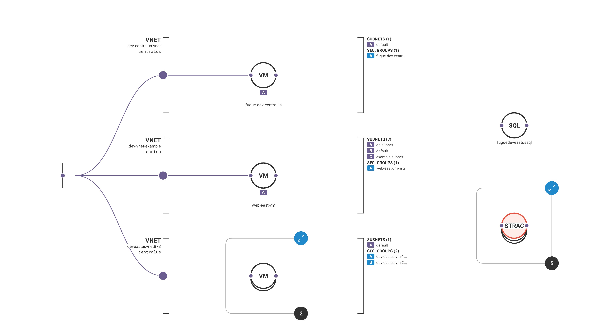

<p align="center">
  

</p>

<h3 align="center">Terraform Practice</h3>


---

<p align="center"> My init to terraform. basic understanding on terraform in google cloud platform
    <br> 
</p>

### Defination

Terraform is a tool for building, changing, and versioning infrastructure safely and efficiently. Terraform can manage existing, popular service providers as well as custom in-house solutions.


The infrastructure Terraform can manage includes low-level components such as compute instances, storage, and networking, as well as high-level components such as DNS entries, SaaS features, etc.

### Prerequisites

What things you need to install the software and how to install them.


### Installing

```
$ brew install terraform
```


